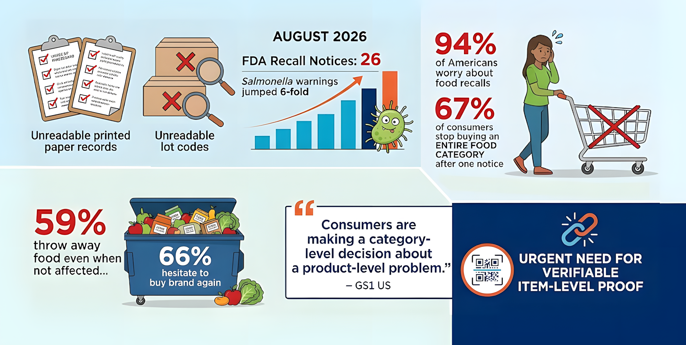

# CodeNova: Food Provenance & Rapid Recall Network

[](https://rubyonrails.org/)
[](https://hotwired.dev/)

> [!TIP]
> This Project is being developed for **CodeNova 2026** (IEEE SIU Dubai Student Branch × IDS).

## The Problem: Recall Panic & Food Waste

Modern food supply chains rely on disconnected paper records and unreadable printed lot codes. When bacterial contamination strikes, shoppers cannot tell whether a specific item in their hands is tainted or safe.



With enforcement of the FDA's Food Traceability Rule (FSMA 204) delayed until July 2028, supply chains lack an interoperable, real-time mechanism to isolate contaminated batches. As investigated by [Fortune and GS1 US](https://fortune.com/2026/09/02/food-recalls-fda-americans-avoid-food-categories/), this information vacuum turns localized contamination into category-wide consumer panic and widespread food waste. Restoring confidence requires instant, item-level cryptographic verification that shoppers and retailers can validate directly at the shelf.


## The Solution: Cryptographic Provenance Chain

CodeNova replaces fragile paper trails with an unbroken chain of cryptographically signed **W3C Verifiable Credentials (VCs)** from farm to grocery shelf:

```
[Food Safety Certifier]
        │ (Issues Origin & Safety Credential with Revocation Enabled)
        ▼
[Exporter / Farm]
        │ (Presents Origin Credential)
        ▼
[Cold-Chain Carrier]
        │ (Verifies Origin → Issues Temperature & Custody Credential)
        ▼
[Customs & Import Clearance]
        │ (Verifies Custody → Issues Port Clearance Credential)
        ▼
[Retailer Shelf & Consumer QR Code]
        │ (Shopper scans QR: instant cryptographic verification)
```


## The 3-Hour Demo Moment

1. **Verified on Shelf:** A shopper scans the shelf QR code on their phone. The mobile browser instantly displays green: `ORIGIN VERIFIED` → `COLD CHAIN VERIFIED` → `SAFE TO CONSUME`.
2. **One-Click Selective Recall:** An inspector flags contamination at the source farm and revokes the specific batch on the IDS revocation registry with one click.
3. **Instant Live Alert:** Without refreshing the page, the shopper's screen immediately flips to flashing red: `BATCH RECALLED / DO NOT SELL`. Untainted batches from other farms remain green, stopping blind panic and keeping safe food on grocery shelves.


## Key Features

- **Selective Batch Revocation:** Revoke contaminated batches in milliseconds on the IDS Bitstring Status List without affecting safe inventory.
- **Zero-Reload Reactive UI:** Hotwire Turbo Streams push live WebSocket state changes directly to mobile browser scanners.
- **Zero-App Consumer Verification:** Standard smartphone cameras scan GS1-compatible 2D QR codes with zero software installation.
- **Privacy-Preserving Proofs:** Zero-Knowledge selective disclosure strips sensitive wholesale pricing and supplier contracts from public view.


## Technology Stack & Component Mapping

| Subsystem / Responsibility | Implementation Technology | Technical Role |
| :--- | :--- | :--- |
| **Credential Issuance** | Ruby / Rails | Generates W3C-compliant `OriginCredential` & `CustodyCredential` payloads. |
| **Credential Verification** | Ruby / Rails | Cryptographically validates signatures, schema fields, and expiry bounds. |
| **Credential Revocation** | Ruby / Rails | Sets revocation bit flags on the IDS registry with one-click admin execution. |
| **Chain & Provenance Logic** | Ruby / Rails | Links custody credentials cryptographically back to the farm origin credential hash. |
| **Database & Persistence** | Rails + ActiveRecord + SQLite | Persists batch metadata, verification audit logs, and cached public DIDs. |
| **Frontend Pages & Live UI** | Rails + ERB + Hotwire (Turbo & Stimulus) | Powers instant zero-reload status flips (`VERIFIED` → `RECALLED`) over WebSockets. |
| **QR Code Generation** | Ruby Gem (`rqrcode` / `chunky_png`) | Generates 2D GS1 Digital Link shelf QR codes dynamically for smartphone scanning. |
| **IDS API Communication** | Ruby HTTP / API Client (`Faraday` / `Net::HTTP`) | Manages REST calls, bearer tokens, and webhook ingestion with the IDS Sandbox. |
| **Authentication & Sessions** | Rails Native (`has_secure_password`) | Provides role-based session isolation for Certifiers, Carriers, and Grocers. |


## Repository Documentation Index

| Document | Focus & Scope |
| :--- | :--- |
| **[Technical Specification & Architecture](docs/technical_documentation.md)** | Full JSON schemas, REST API specs, Mermaid system diagrams, and security model. |
| **[Round 2 & 3 Execution Playbook](docs/round_2_3_playbook.md)** | 3-hour build sprint schedule, 11-item deliverables tracker, and 3-minute pitch cue sheet. |
| **[Round 1 Qualification & Study Guide](docs/round_1_study_guide.md)** | Competition schedule, quiz topics, tie-breaker rules, and preparation checklist. |


## Team Members

- **Oumar Mamoun Ibrahim:** Team Leader & Project Manager  
  [](https://orcid.org/0009-0008-0312-1605) [](https://www.ieee.org/)  
  Email: [U22200741@sharjah.ac.ae](mailto:U22200741@sharjah.ac.ae) / [omarbenzema50@gmail.com](mailto:omarbenzema50@gmail.com) | Phone: [+971 56 632 6900](tel:+971566326900)
- **Mohamad Khairi Bin Ishak:** Documentation Lead & Core Contributor
- **Nameer Anwar:** Research / Documentation Lead
