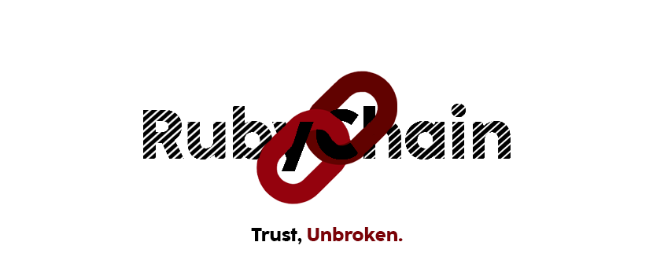
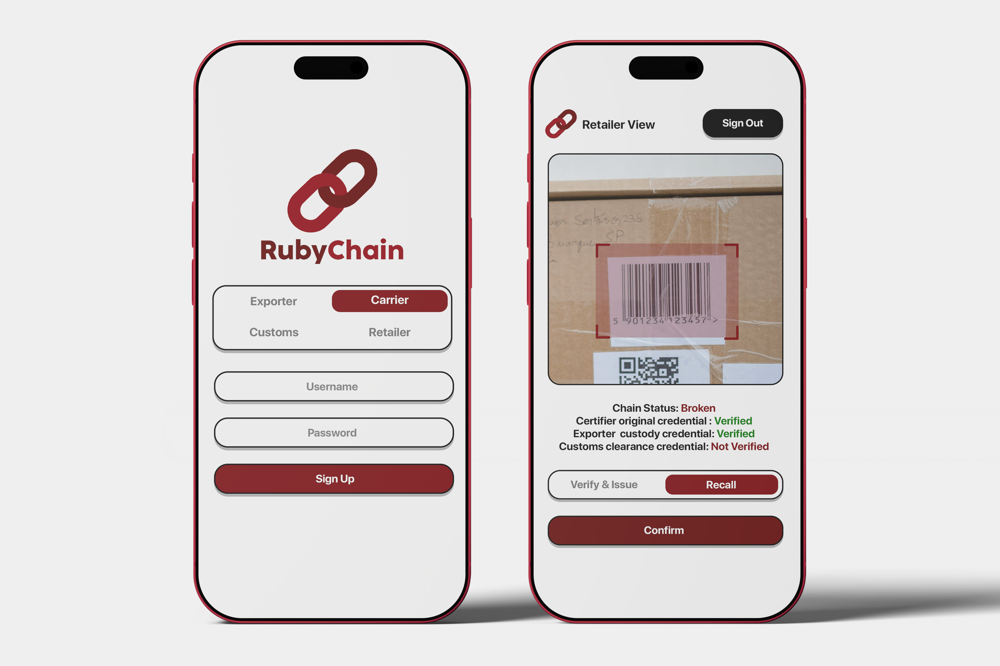

<div align="center">

# RubyChain

[](https://rubyonrails.org/)
[](https://hotwired.dev/)
[](LICENSE)



</div>

> [!TIP]
> This Project is being developed for **CodeNova 2026** [(IEEE SIU Dubai Student Branch × IDS)](https://www.google.com/maps/place/Symbiosis+International+University+Dubai+%D8%AC%D8%A7%D9%85%D8%B9%D8%A9+%D8%B3%D9%85%D8%A8%D9%8A%D9%88%D8%B3%D9%8A%D8%B3%E2%80%AD/@25.1035795,55.1652636,175m/data=!3m1!1e3!4m6!3m5!1s0x3e5f6b0004b9dc29:0x840b5f64965d1ce6!8m2!3d25.1035336!4d55.1652772!16s%2Fg%2F11vx5qmbwn?entry=ttu&g_ep=EgoyMDI2MDgzMS4wIKXMDSoASAFQAw%3D%3D).

## Round 1

The round will be conducted as an online MCQ-based quiz using one of the following platforms (to be determined):
- Kahoot
- Quizizz
- Google Forms

### Question Categories

The quiz may include questions covering:
- Concepts discussed during the IDS pre-orientation.
- Technology fundamentals.
- Programming and computational thinking.
- Problem-solving and debugging.
- Digital technologies relevant to the competition.
- Basic product and innovation concepts.

## Round 2

### Problem 
A shipment of coffee claims organic, fair-trade, and cold-chain compliance, which is a folder of PDFs anyone can alter.

**How the Chain Works**

* **Certifier** *(Already saved in the database)*: Checks where the product was made, confirms it is real, and creates the first pass.
* **Exporter** *(Step 1)*: Checks that the Certifier's pass is real before taking the boxes.
* **Carrier** *(Step 2)*: Checks the paperwork before loading the boxes onto the ship or plane.
* **Customs** *(Step 3)*: Checks **two** passes at once (Certifier and Carrier) before letting the goods cross the border.
* **Retailer** *(Step 4)*: Checks that **all three** past passes are approved and no recall exists before selling the product.

**Recall:** If a bad batch is recalled, the whole chain breaks instantly and stops future scans.
### Chain

> [!NOTE]
> Four handoffs, each verify-then-issue.

```text
Certifier (pre-seeded before clock starts) → exporter → carrier → customs → retailer. 
```

### Demo
1. Scan the shelf QR code to see the full unbroken chain.
2. Revoke the batch and watch the shelf status turn red.



## Round 2 Deliverables 

The submission should contain, where applicable:
1.	Project / Product Name
2.	Team Name
3.	Problem Statement
4.	Solution Description
5.	Prototype / Product Link or File
6.	Source Code / Repository
7.	README or Technical Documentation
8.	Technology Stack
9.	AI Usage Declaration
10.	Security & Privacy Declaration
11.	Any additional materials requested by the organizers

## Round 3
Each team will be given a fixed pitching slot. The recommended format is 3–5 minutes per team, followed by a short Q&A / judge interaction period.
1.	The Problem — What problem are you solving?
2.	The Solution — What have you built?
3.	How It Works — Briefly explain the technology and implementation.
4.	Demonstration — Show the product/prototype working.
5.	Impact & Innovation — Why does the solution matter?
6.	Future Potential — How could the product be improved, scaled, or deployed in the real world?

> Presentation: made using docs in `./docs`

## Project Structure

```text
../
├── src/                                      # round 2
│   │── main.rb          
│   │── certifier.rb (pre-seeded before clock starts) 
│   │── exporter.rb          
│   │── customs.rb          
│   │── retailer.rb         
│   └── recall.rb    
├── docs/                                     # round 3 
│   │── problem.md              
│   │── demo.md               
│   │── impact.md
│   │── implementation.md      
│   │── innovation.md      
│   │── pitch.md      
│   └── ui.md     
└── README.md                 
```

## Team Members

1. **Oumar Mamoun Ibrahim:** Team Leader
  - [](https://orcid.org/0009-0008-0312-1605) [](https://www.ieee.org/)  
  - Email: [U22200741@sharjah.ac.ae](mailto:U22200741@sharjah.ac.ae) | Phone: [+971 56 632 6900](tel:+971566326900)
2. **Mohamad Khairi Bin Ishak**
3. **Nameer Anwar** 
  - Email: [nameeranwar@yahoo.com](mailto:nameeranwar@yahoo.com) | Phone: [+971 56 959 5743](tel:+971569595743)
4. **Aqsa Khan**
