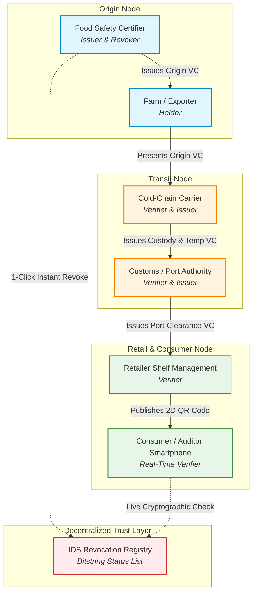
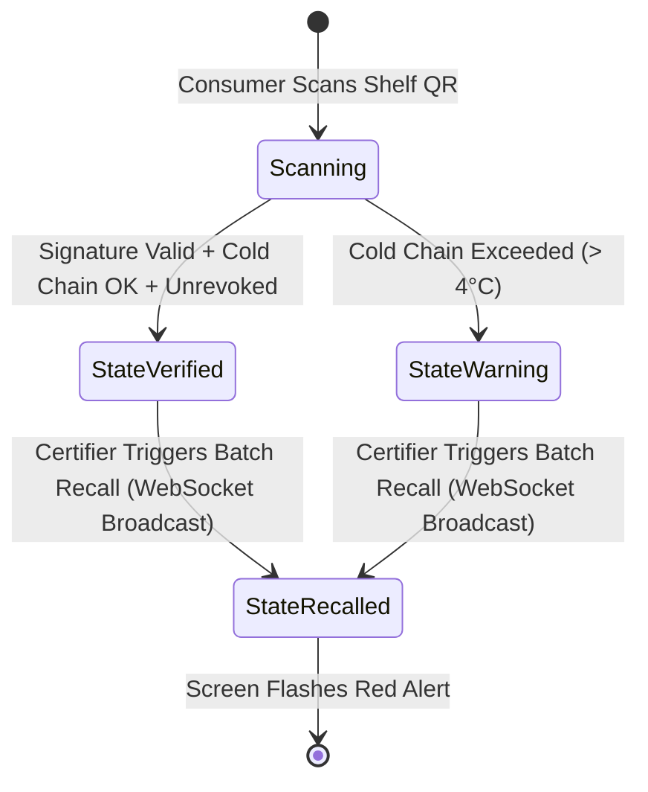

# Technical Specification & System Architecture
## Food Supply Chain Provenance & Rapid Recall Network (Use Case #4)

> **Document Type:** Technical Specification & System Architecture  
> **Target Audience:** Hackathon Judges, Technical Evaluators, and Core Developers  
> **System Scope:** Multi-Hop Verifiable Credential Chain with Real-Time Cryptographic Revocation  
> **Compliance & Standards:** W3C Verifiable Credentials Data Model v2.0, W3C Decentralized Identifiers (DIDs) v1.0, GS1 Digital Link

---

## 1. Abstract (Executive Overview)

Modern food supply chains face a catastrophic crisis of consumer trust caused by opaque paper records and slow, broadcast-style recall notices. When bacterial outbreaks occur, retailers and consumers cannot determine whether a specific item in their hands is contaminated. Consequently, consumers panic and avoid entire food categories, resulting in millions of dollars of safe food wasted and severe financial damage to honest producers.

This technical specification details the architecture for the **CodeNova Food Provenance & Rapid Recall Network** (Use Case #4). Built on the **Digital Identity Stack (IDS)**, the system models each stage of the supply chain as a chained series of cryptographically signed **Verifiable Credentials (VCs)**. By combining batch-level credential issuance with an instant cryptographic **Revocation Registry**, the platform allows inspectors to revoke an isolated tainted batch with a single click. Downstream retailers and consumer mobile scanners instantly detect the status flip from `VERIFIED` to `RECALLED / DO NOT SELL` without page reloads, eliminating blind panic and keeping healthy food on grocery shelves.

---

## 2. Problem Statement & Empirical Grounding (Invention)

### 2.1 The Food Recall Crisis
According to a national investigation reported by [Fortune](https://fortune.com/2026/09/02/food-recalls-fda-americans-avoid-food-categories/):
- **Surging Recalls:** In August 2026 alone, the FDA issued **26 food recall notices** (up from 19 in August 2024 and 18 in August 2025). Recalls linked to *Salmonella* jumped sixfold, affecting staples including produce, eggs, and dairy.
- **The Category Avoidance Dilemma:** A nationwide survey conducted by GS1 US revealed that **94% of American adults worry about recall frequency**. Critically, **67% of consumers stop buying an entire food category** (e.g., all romaine lettuce or all eggs) after hearing a single recall announcement.
- **Wasted Safe Produce:** **59% of consumers throw away food** even when their state or geographic region was never affected, because printed lot numbers on packaging are confusing or unreadable. Furthermore, **66% hesitate to purchase the brand again**.
- **Middlemen & Data Separation:** As GS1 US noted, *"Consumers are making a category-level decision about a product-level problem."* Because food passes through multiple growers, packers, cold-chain transporters, and distribution hubs, provenance data gets separated from physical inventory.
- **Regulatory Gap:** Congress delayed enforcement of the FDA’s Food Traceability Rule (FSMA Section 204) to **July 2028**, creating an urgent multi-year gap that decentralized cryptographic identity can solve immediately.

### 2.2 System Utility & Usability Goals
- **Utility:** Replace paper bills of lading and unreadable printed ink codes with verifiable cryptographic chains from origin farm to grocery shelf.
- **Usability:** Provide instant, zero-friction verification for end consumers via a standard smartphone browser and 2D QR code scanner—no special mobile app installation required.

---

## 3. System Architecture & Component Decomposition (Arrangement)

The platform employs a multi-tenant decentralized architecture divided into four primary actor nodes, following the W3C Issuer-Holder-Verifier triad:



### 3.1 Component Breakdown (Parts-of-an-Object)

1. **Certifier Recall Console (`Node: Issuer / Revoker`):**
   - Authorizes farm safety certifications and issues the base `OriginCredential`.
   - Maintains real-time authority over the revocation index in the IDS Revocation Registry.
   - Hosts the emergency "Trigger Batch Recall" action for immediate network propagation.

2. **Supply Chain Carrier Gateway (`Node: Verifier & Secondary Issuer`):**
   - Verifies the cryptographic signature and validity of the farm's `OriginCredential`.
   - Ingests IoT temperature sensor telemetry during transit.
   - Issues the chained `CustodyCredential` binding origin proof to cold-chain compliance.

3. **Retailer Shelf QR Service (`Node: Presentation Generator`):**
   - Aggregates verified credentials into a W3C Verifiable Presentation (VP).
   - Generates a GS1 Digital Link compliant QR code placed on physical store shelves.

4. **Consumer Instant-Audit Interface (`Node: Universal Verifier`):**
   - Web application rendered directly in mobile browsers upon QR scan.
   - Subscribes to Hotwire Turbo Streams via WebSockets for zero-reload reactive state updates.

### 3.2 Implementation Stack & Responsibility Matrix

| Subsystem / Architectural Responsibility | Technology Choice | Technical Role & Implementation Detail |
| :--- | :--- | :--- |
| **Credential Issuance** | Ruby / Rails | Builds and signs W3C-compliant `OriginCredential` & `CustodyCredential` payloads. |
| **Credential Verification** | Ruby / Rails | Cryptographically validates digital signatures, schema properties, and expiry timestamps. |
| **Credential Revocation** | Ruby / Rails | Updates bitstring revocation flags on the IDS registry with one-click admin execution. |
| **Chain & Provenance Logic** | Ruby / Rails | Cryptographically references the parent `originCredentialHash` within downstream custody records. |
| **Database & Persistence** | Rails + ActiveRecord + SQLite | Persists batch records, verification audit logs, and cached public DID documents locally. |
| **Frontend Pages & Reactive UI** | Rails + ERB + Hotwire (Turbo & Stimulus) | Streams live WebSocket status transitions (`VERIFIED` → `RECALLED`) without full page reloads. |
| **QR Code Generation** | Ruby Gem (`rqrcode` / `chunky_png`) | Generates GS1 Digital Link compliant 2D QR codes on-the-fly for physical shelf display. |
| **IDS API Communication** | Ruby HTTP Client (`Faraday` / `Net::HTTP`) | Dispatches authenticated REST requests, manages bearer tokens, and ingests IDS webhooks. |
| **Authentication & Session Logic** | Rails Native (`has_secure_password`) | Manages role-based multi-tenant authentication for Certifiers, Carriers, and Retailers. |

---

## 4. Data Models & Schema Specifications

All credentials adhere to the W3C Verifiable Credentials Data Model v2.0 using JSON-LD with SHA-256 cryptographic proof suites.

### 4.1 `OriginCredential` Schema (Farm Safety & Harvest)
Issued by the accredited Food Safety Certifier to the producer:

```json
{
  "$schema": "https://json-schema.org/draft/2020-12/schema",
  "title": "OriginCredential",
  "type": "object",
  "required": [
    "@context",
    "id",
    "type",
    "issuer",
    "issuanceDate",
    "credentialSubject",
    "credentialStatus"
  ],
  "properties": {
    "@context": {
      "type": "array",
      "items": { "type": "string" }
    },
    "id": { "type": "string", "format": "uri" },
    "type": {
      "type": "array",
      "items": { "type": "string" }
    },
    "issuer": { "type": "string", "format": "uri" },
    "issuanceDate": { "type": "string", "format": "date-time" },
    "credentialSubject": {
      "type": "object",
      "required": ["id", "batchId", "productName", "farmGln", "harvestDate", "pathogenClearance"],
      "properties": {
        "id": { "type": "string", "format": "uri" },
        "batchId": { "type": "string", "pattern": "^BATCH-[A-Z0-9-]+$" },
        "productName": { "type": "string" },
        "farmGln": { "type": "string", "description": "GS1 Global Location Number" },
        "harvestDate": { "type": "string", "format": "date" },
        "pathogenClearance": { "type": "boolean" }
      }
    },
    "credentialStatus": {
      "type": "object",
      "required": ["id", "type", "statusListIndex", "statusListCredential"],
      "properties": {
        "id": { "type": "string", "format": "uri" },
        "type": { "type": "string", "enum": ["BitstringStatusListEntry"] },
        "statusPurpose": { "type": "string", "enum": ["revocation"] },
        "statusListIndex": { "type": "integer" },
        "statusListCredential": { "type": "string", "format": "uri" }
      }
    }
  }
}
```

### 4.2 `CustodyCredential` Schema (Cold-Chain Transit)
Issued by the logistics carrier upon verifying the `OriginCredential`:

```json
{
  "$schema": "https://json-schema.org/draft/2020-12/schema",
  "title": "CustodyCredential",
  "type": "object",
  "required": [
    "@context",
    "id",
    "type",
    "issuer",
    "issuanceDate",
    "credentialSubject"
  ],
  "properties": {
    "credentialSubject": {
      "type": "object",
      "required": [
        "batchId",
        "carrierName",
        "maxTempCelsius",
        "coldChainMaintained",
        "originCredentialHash"
      ],
      "properties": {
        "batchId": { "type": "string" },
        "carrierName": { "type": "string" },
        "maxTempCelsius": { "type": "number" },
        "coldChainMaintained": { "type": "boolean" },
        "originCredentialHash": {
          "type": "string",
          "pattern": "^sha256:[a-f0-9]{64}$",
          "description": "Cryptographic hash binding to parent OriginCredential"
        }
      }
    }
  }
}
```

---

## 5. API Endpoints & Communication Protocols

All interactions communicate over TLS 1.3 using RESTful JSON and WebSocket protocols.

### 5.1 Endpoint Catalog

| Method | Endpoint Path | Producer Node | Consumer Node | Description | Status Codes |
| :--- | :--- | :--- | :--- | :--- | :--- |
| `POST` | `/api/v1/credentials/origin` | Food Safety Certifier | Farm / Producer | Issues new batch origin credential with revocation status entry. | `201 Created`<br>`400 Bad Request`<br>`401 Unauthorized` |
| `POST` | `/api/v1/credentials/custody` | Cold-Chain Carrier | Logistics Portal | Verifies origin hash and issues cold-chain custody proof. | `201 Created`<br>`422 Unprocessable` |
| `POST` | `/api/v1/credentials/revoke` | Certifier Console | IDS Sandbox Registry | Sets revocation bit flag for the target batch. | `200 OK`<br>`404 Not Found`<br>`500 Server Error` |
| `GET` | `/api/v1/batches/:batch_id/verify` | Retailer QR Endpoint | Smartphone Verifier | Evaluates cryptographic signatures, cold-chain checks, and revocation state. | `200 OK`<br>`404 Not Found` |
| `WS` | `/cable` (ActionCable) | Hotwire Turbo Engine | Active Scanner UIs | Pushes live Turbo Streams broadcast when revocation occurs. | `101 Switching Protocols` |

### 5.2 Sample Request & Response (Batch Revocation)

**Request Payload (`POST /api/v1/credentials/revoke`):**
```http
POST /api/v1/credentials/revoke HTTP/1.1
Host: api.codenova.ids.sandbox
Authorization: Bearer <CERTIFIER_API_TOKEN>
Content-Type: application/json

{
  "batch_id": "BATCH-PRODUCE-2026-X8",
  "revocation_reason": "Pathogen Detection: Salmonella enterica confirmed in irrigation source",
  "revoked_at": "2026-09-18T10:15:30Z"
}
```

**Response Payload (`HTTP 200 OK`):**
```json
{
  "status": "REVOKED",
  "batch_id": "BATCH-PRODUCE-2026-X8",
  "registry_tx_id": "0x8fa41d7e3352bc1940ef91a274b5c73918a4d70b",
  "revocation_index": 4208,
  "propagation_latency_ms": 142,
  "message": "Revocation bit updated on IDS registry. Turbo broadcast published."
}
```

---

## 6. UX Design & Interface State Machine ("Writing Around the Interface")

Technical documentation must specify the state transitions visible to end users. The consumer verification interface behaves as a deterministic finite state machine with three visible states:



### 6.1 UI Screen Specifications

| State Identifier | Visual Appearance | Displayed Headline | Consumer Directive | Retailer Directive |
| :--- | :--- | :--- | :--- | :--- |
| **State 1: VERIFIED** | Pure Green (`#16a34a`) background with animated checkmark. | `ORIGIN & COLD CHAIN VERIFIED` | Safe to purchase and consume. Full harvest and carrier log visible. | Maintain normal shelf inventory. |
| **State 2: WARNING** | Amber (`#d97706`) border with thermometer icon. | `COLD CHAIN EXCEEDED` | Quality caution: transit temperature reached 6.2°C. | Conduct manual inspection before checkout. |
| **State 3: RECALLED** | Flashing Red (`#dc2626`) alert with prominent warning icon. | `CRITICAL RECALL: DO NOT SELL` | **Do not consume.** Return product to counter for immediate refund. | **Remove batch immediately.** POS register lockout engaged. |

---

## 7. Security, Privacy & Integrity Guarantees

1. **Zero-Knowledge Selective Disclosure:**
   - Retail pricing, proprietary supplier contracts, and wholesale margins are stripped from the consumer-facing Verifiable Presentation. Only safety-critical attributes (`batchId`, `harvestDate`, `coldChainMaintained`, `certifierSignature`) are presented.
2. **Cryptographic Non-Repudiation:**
   - Every claim is signed using Ed25519 asymmetric keypairs tied to the issuer's Decentralized Identifier (`did:key` or `did:web`). Neither the carrier nor the grocer can forge or backdate an origin clearance.
3. **Offline Verification Resilience:**
   - Verifier nodes cache the cryptographic public keys of accredited certifiers and carriers. If an offline mobile scanner inspects a credential, it can cryptographically verify mathematical authenticity locally, requiring network access solely to fetch the latest revocation bitstring.

---

## 8. Conclusion & Implementation Verification (Action)

This technical specification establishes an end-to-end blueprint for Use Case #4. By addressing the root cause of food recall panic—data opacity and inability to isolate tainted batches—the platform provides a viable technical solution to restore consumer trust and prevent category-level food boycotts.

### 8.1 3-Hour Sprint Deliverable Verification

To verify that the implementation adheres to this specification during the 3-hour Build Sprint, execute the following operational sequence:

1. **Seed Credential:** Run Rails seed runner to register accredited certifier DID and issue initial `OriginCredential`.
2. **Execute Custody Handoff:** Submit POST request to `/api/v1/credentials/custody` verifying temperature telemetry (< 4°C).
3. **Verify Green Shelf State:** Open `/verify/BATCH-PRODUCE-2026-X8` in browser. Confirm all-green `VERIFIED` state.
4. **Trigger Live Revocation:** In the Certifier Console, click **"Trigger Batch Recall"**.
5. **Confirm Zero-Reload Flip:** Observe mobile screen. Verify badge transitions to red `BATCH RECALLED / DO NOT SELL` within < 500ms via Turbo Streams WebSocket.
